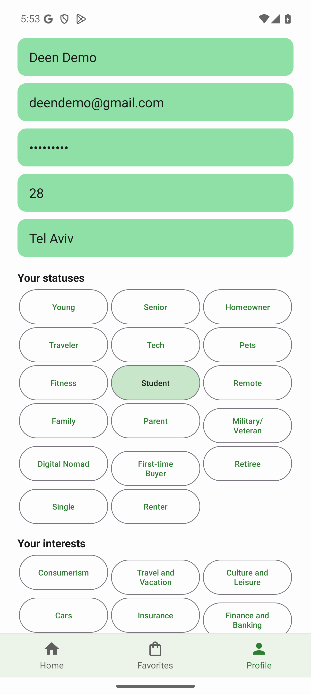
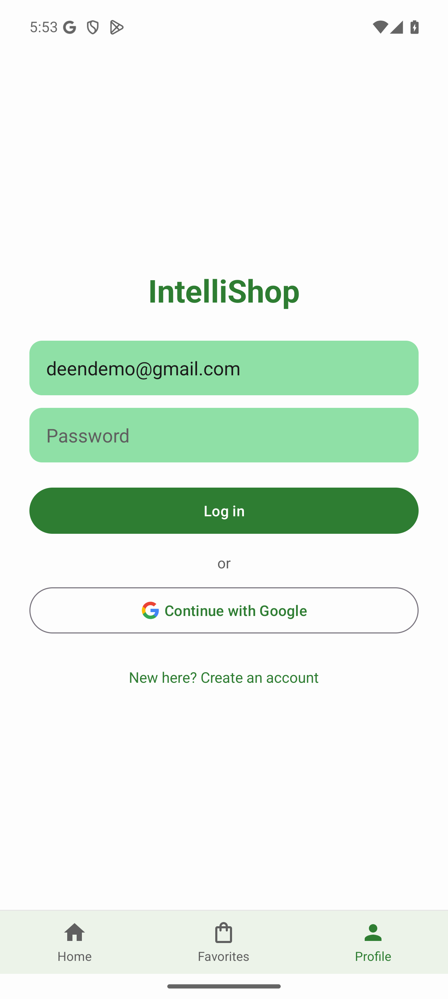
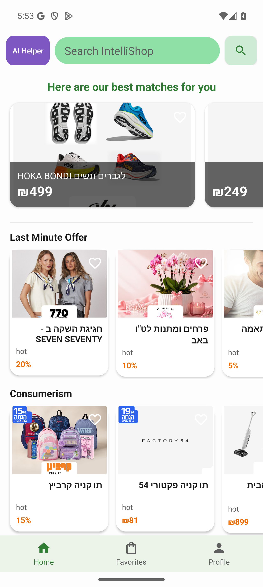
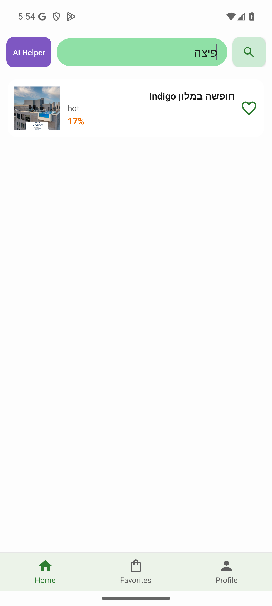
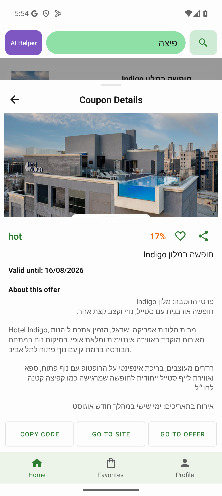
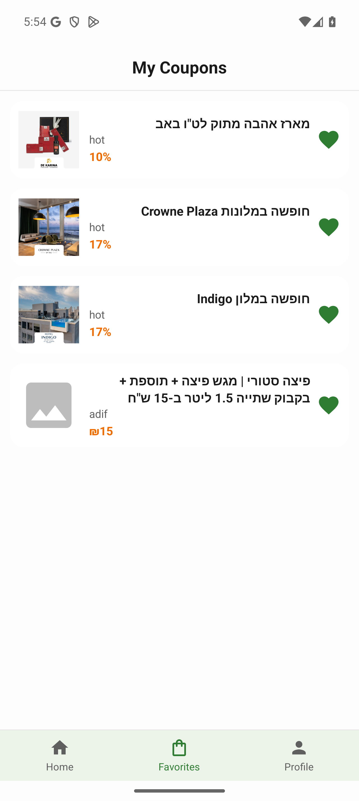
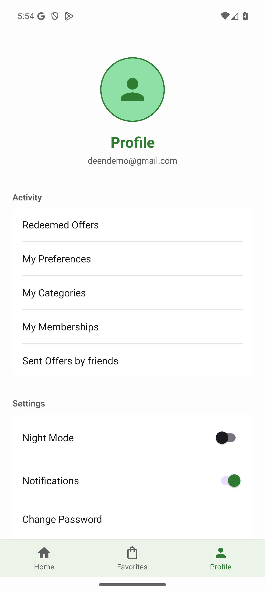
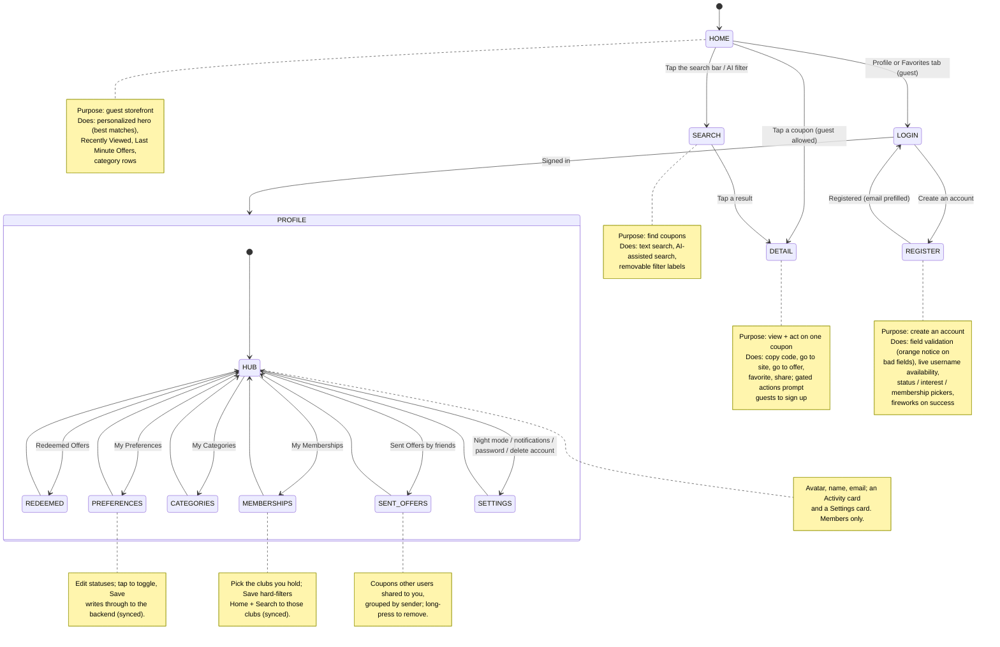

# IntelliShop Android App

IntelliShop for Android is a native Kotlin client for the IntelliShop coupon service. It is the application layer of the project: a guest-browsable storefront with a personalized home feed, text and AI-assisted search, coupon details with copy/redeem actions, per-account favorites and redeemed offers, coupon sharing between users, membership-based filtering, and an editable profile. It runs on top of the existing IntelliShop Django/MongoDB backend, which is developed and documented separately in the [Intelli_Shop](https://github.com/GiladShekalim/Intelli_Shop) repository. The work in this repository is the Kotlin app itself; the backend is consumed as a service over HTTP.

## Screenshots

<p align="center">
  
  
  
  
</p>
<p align="center">
  
  
  
</p>

*Registration · Login · Home · Search · Coupon detail · Favorites · Profile.*

## Demo video

A short walkthrough of the full user flow — **[▶ watch `screenshots/demo.mp4`](screenshots/demo.mp4)**:

1. **Register** a new member ("Deen Demo", Tel Aviv, one label chosen in each of statuses / interests / memberships) and sign in.
2. Browse the **personalized Home** (best-matches hero, Last Minute, category rows) and open **Search**.
3. Open a **coupon detail**, **copy its code**, and **save it to Favorites** (a themed list — love-day, trips, pizza).
4. **Share** the coupon to another user ("Tov Meod").
5. Sign in as **Tov Meod** and see the received offer under **Sent Offers by friends**.

## Design (Figma)

Interactive prototype: **[IntelliShop on Figma](https://www.figma.com/proto/e65jjbIl4APuTxXeWiue2F/IntelliShop-App-Design?node-id=332-4446&starting-point-node-id=332%3A4446)**

## Quick start

The app runs against a running IntelliShop backend (local Django server by default).

### 1) Start the backend

Run the IntelliShop Django server so it listens on the host machine:

```
python manage.py runserver 0.0.0.0:8000
```

See the [Intelli_Shop](https://github.com/GiladShekalim/Intelli_Shop) repository for full backend setup (MongoDB, Groq, seed data).

### 2) Point the app at the backend

The base URL lives in one place, `Constants.Api.BASE_URL`. The default is `http://10.0.2.2:8000/` — `10.0.2.2` is the Android emulator's alias for the host loopback. For a physical device on the same network, set your machine's LAN IP here and add it to `res/xml/network_security_config.xml`.

### 3) Open and run

Open the project in Android Studio, let Gradle sync, and run the `app` configuration on an emulator (or a device). The app launches on the guest Home screen — no login required to browse.

### 4) Sign in to unlock actions

Register a new account (with a live username-availability check) or sign in with email/password or Google. Signing in unlocks saving favorites, redeeming coupons, sharing, and editing preferences; guests are prompted to sign up when they attempt a gated action.

## Features

- Guest-browsable home: a personalized "best matches" hero (up to 15 coupons across two big-card rows), Recently Viewed, Last Minute Offers, and a row per category
- Text search and AI-assisted search with removable filter labels
- Coupon detail sheet: copy code, go to site, go to offer, favorite, share, and a bold validity line that turns red when expired; prices shown in Israeli shekels (₪)
- Email/password and Google sign-in; live username-availability check during registration
- Per-account data synced from the backend: favorites, redeemed offers, and preferences/interests/memberships
- Share a coupon with another user by username; a "Sent Offers by friends" page grouped by sender, with long-press to remove
- Editable My Preferences / My Categories / My Memberships, synced across devices
- My Memberships: select the clubs you hold (e.g. HOT, Adif) to hard-filter discovery surfaces — Home feed and Search show only coupons from those clubs (an empty selection means no filter); the user's own lists and friend-shared coupons are never filtered
- Profile: day/night mode, in-app notifications toggle, change password, delete account, Google account photo
- Responsive feedback: a slide-in notification banner and scale-independent fireworks on account creation, saved preferences/categories, copying a code, and an empty Favorites tab

## Technologies

- Language: Kotlin, Android XML views (no Jetpack Compose)
- UI: Material Components, single-Activity shell with fragments (show/hide + back-stack overlays), DayNight theming
- Networking: Retrofit + OkHttp + Gson, session-cookie auth via PersistentCookieJar
- Images: Glide
- Concurrency: Kotlin coroutines (`lifecycleScope`)
- Auth: Credential Manager / Google Identity for Google sign-in
- Storage: SharedPreferences (Gson round-trip) via a singleton wrapper
- Testing: Espresso instrumented tests + JUnit JVM unit tests, run as a two-group gate
- Deliberately course-native: no ViewModel/LiveData, no Navigation Component, no Room, no DI framework

## System Architecture

Subsystems and purposes:

- App shell (`MainActivity`): owns the static top bar (AI filter / search field / search), the custom bottom tab bar, the content frame, and the notification banner; hosts Home / Favorites / Profile fragments (added once, shown/hidden) and pushes overlays (Login, Register, Coupon Detail, Search, Preferences, Coupon History, Sent Offers) onto the back stack
- Screens (`ui/`): one `Fragment` per screen, each following `findViews()` then `initViews()`
- Repositories (`repository/`): one per backend concern; every method is `suspend`, wrapped in try/catch, and returns a typed `ApiResult.Success/Error`. Write-through calls treat a 401 as a local-only success so the app keeps working, and reads fall back to the local mirror when unauthenticated
- Network (`network/`): `ApiService` (Retrofit interface) and `RetrofitClient` (OkHttp + cookie jar); the JSON branch is selected with an `Accept: application/json` header so the backend's web pages are unaffected
- Session (`utilities/SessionManager`): the logged-in `UserSession` plus per-user local mirrors (favorites, redeemed, received shares) and app settings (night mode, notifications), keyed by email
- Logic (`logic/`): pure, JVM-testable helpers — `CouponRanker` (personalization), `CouponFormatter` (shekel price / date), `MembershipFilter` (hard-filter discovery surfaces by selected club), `SharedOffersGrouper` (group shares by sender)

## State Machine Diagrams

Screen-level navigation for the app. Guests can browse and open coupons; the sign-in gate lives on the actions inside the detail sheet and on the Profile/Favorites tabs.



## Simplified Directory tree

```
app/src/
  main/
    java/com/example/intellishopapp/
      App.kt                  # Application: initializes app-scoped singletons
      MainActivity.kt         # single-Activity shell: top bar, tabs, overlays, banner
      ui/                     # one Fragment per screen
        HomeFragment.kt         # personalized hero + Recently Viewed + Last Minute + categories
        SearchFragment.kt       # text / AI search, removable filter labels
        CouponDetailFragment.kt # slide-up sheet: copy / site / offer / favorite / share
        FavoritesFragment.kt    # saved coupons (Favorites tab)
        CouponHistoryFragment.kt# Redeemed Offers page
        SentOffersFragment.kt   # coupons shared to you, grouped by sender
        PreferencesFragment.kt  # editable My Preferences / My Categories / My Memberships
        ProfileFragment.kt      # avatar, activity card, settings card
        LoginFragment.kt / RegisterFragment.kt
      adapter/CouponAdapter.kt  # renders coupons into card/row layouts
      repository/             # AuthRepository, CouponRepository, SearchRepository,
                              # FavoriteRepository, HistoryRepository, RedeemRepository,
                              # ShareRepository, ProfileRepository (suspend + ApiResult)
      network/                # ApiService (Retrofit), RetrofitClient (OkHttp + cookies)
      model/                  # UserSession + model/dto/ (wire models, exact backend names)
      logic/                  # CouponRanker, CouponFormatter, MembershipFilter,
                              # SharedOffersGrouper (pure)
      utilities/              # SessionManager, Constants, ApiResult, SignalManager,
                              # GoogleAuthHelper
    res/
      layout/                 # XML screens and item/card/section layouts
      values/ , values-night/ # strings, colors, DayNight overrides
      drawable/ , mipmap-*/   # vectors, backgrounds, launcher icon
      xml/network_security_config.xml
  test/                       # JVM unit tests (logic + DTO parsing)
  androidTest/                # Espresso instrumented tests
```

## Main workflows

1) Browse and redeem
- Anyone browses Home and opens a coupon's detail sheet; opening records a "view" (feeds Recently Viewed)
- A signed-in user copies the code or goes to the site/offer, which records a "redemption" (feeds Redeemed Offers); guests get a sign-up prompt instead

2) Personalization
- The home hero mirrors the backend's `index_home` ranking: the catalog is pre-filtered to the user's statuses and interests, then coupons are weighted by how often their categories/statuses appear across the user's favorites (with a large boost for favorites), and the top results are shown
- Favorites come from the backend, and statuses/interests are seeded from the login response and read fresh from `/profile/`, so personalization works on any device

3) Sharing between users
- From a coupon, a member shares by username; the backend records the share on the recipient's account with the sender identity taken from the session (never the request body)
- The recipient opens "Sent Offers by friends", sees coupons grouped by sender, and can long-press to remove one

4) Editing preferences and memberships
- My Preferences / My Categories / My Memberships load the current selection from the backend, toggle on tap, and Save writes all three dimensions back (optimistically to the session, then through to the backend for cross-device sync)
- Memberships act differently from the ranking dimensions: they are a hard filter applied by `MembershipFilter` to the discovery surfaces (Home hero, Last Minute, category rows, and Search results), so those show only coupons whose `club_name` matches a selected club. An empty selection means no filter. Recently Viewed, Favorites, Redeemed offers, and friend-shared coupons are deliberately left unfiltered

## Subsystems and navigation

- Shell: [app/src/main/java/com/example/intellishopapp/MainActivity.kt](app/src/main/java/com/example/intellishopapp/MainActivity.kt)
  - Purpose: top bar, bottom tabs, overlay navigation, the notification banner, favorite/sign-out/search plumbing
- Home: [ui/HomeFragment.kt](app/src/main/java/com/example/intellishopapp/ui/HomeFragment.kt)
  - Purpose: personalized hero and the Recently Viewed / Last Minute / category rows
- Coupon detail: [ui/CouponDetailFragment.kt](app/src/main/java/com/example/intellishopapp/ui/CouponDetailFragment.kt)
  - Purpose: the slide-up sheet and its gated actions (copy, site, offer, favorite, share)
- Sharing: [ui/SentOffersFragment.kt](app/src/main/java/com/example/intellishopapp/ui/SentOffersFragment.kt), [repository/ShareRepository.kt](app/src/main/java/com/example/intellishopapp/repository/ShareRepository.kt), [logic/SharedOffersGrouper.kt](app/src/main/java/com/example/intellishopapp/logic/SharedOffersGrouper.kt)
  - Purpose: send a coupon by username; group received shares by sender; remove
- Preferences & memberships: [ui/PreferencesFragment.kt](app/src/main/java/com/example/intellishopapp/ui/PreferencesFragment.kt), [repository/ProfileRepository.kt](app/src/main/java/com/example/intellishopapp/repository/ProfileRepository.kt)
  - Purpose: edit and sync statuses / interests / memberships (one editor, three dimensions)
- Personalization: [logic/CouponRanker.kt](app/src/main/java/com/example/intellishopapp/logic/CouponRanker.kt)
  - Purpose: profile pre-filter + favorite-weighted ranking, matching the backend
- Membership filter: [logic/MembershipFilter.kt](app/src/main/java/com/example/intellishopapp/logic/MembershipFilter.kt)
  - Purpose: hard-filter the discovery surfaces (Home + Search) to the user's selected clubs
- Network: [network/ApiService.kt](app/src/main/java/com/example/intellishopapp/network/ApiService.kt), [network/RetrofitClient.kt](app/src/main/java/com/example/intellishopapp/network/RetrofitClient.kt)
  - Purpose: the Retrofit surface and the session-cookie HTTP client
- Session: [utilities/SessionManager.kt](app/src/main/java/com/example/intellishopapp/utilities/SessionManager.kt)
  - Purpose: the logged-in user and the per-user local mirrors + settings

## Data schema (client)

- `CouponDto` (wire model, exact backend field names): `discount_id`, `title`, `price`, `discount_type`, `description`, `image_link`, `discount_link`, `provider_link`, `coupon_code`, `terms_and_conditions`, `club_name[]`, `category[]`, `consumer_statuses[]`, `valid_until`, `usage_limit`
- `UserSession`: `userId`, `email`, `username`, `status[]`, `hobbies[]`, `memberships[]`, `knownFavoriteIds`, `isGoogle`
- Per-user data synced from the backend: `favorites`, `redeemed`, `received_shares` (`{from_user_id, from_username, discount_id}`), and profile `status` / `hobbies` / `membership`

## Endpoints

The app is a client of the IntelliShop backend (see the [Intelli_Shop](https://github.com/GiladShekalim/Intelli_Shop) repository); it consumes these endpoints rather than defining them. JSON responses are requested with an `Accept: application/json` header so the backend's existing web pages are unchanged.

- Auth — `POST /login/`, `POST /register/`, `POST /google_login/`, `GET /check_username/`
- Catalog / search — `GET /show_all_discounts/`, `POST /filtered_discounts/`, `POST /search_discounts/`, `POST /ai_filter_helper/`
- Favorites — `GET /favorites/`, `POST /add_favorite/`, `POST /remove_favorite/`
- Recently viewed — `POST /add_history/`, `GET /history/`
- Redeemed offers — `POST /add_redeemed/`, `GET /redeemed/`
- Sharing — `POST /share_coupon/`, `GET /received_shares/`, `POST /remove_share/`
- Profile — `GET /profile/` (statuses / interests / memberships), `POST /profile/` (`update_password`, `update_preferences` — statuses + interests + memberships, `delete_account`)

## Contributors

<table>
  <tr>
    <td align="center">
      <a href="https://github.com/GiladShekalim">
        
        <br />
        <sub><b>Gilad Shekalim</b></sub>
      </a>
    </td>
  </tr>
</table>
